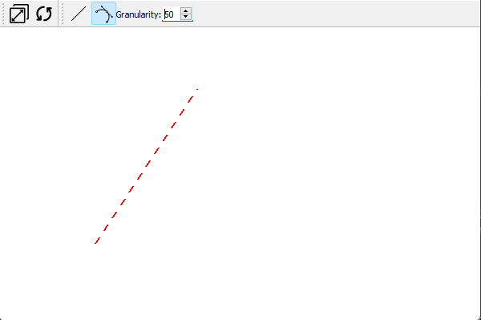
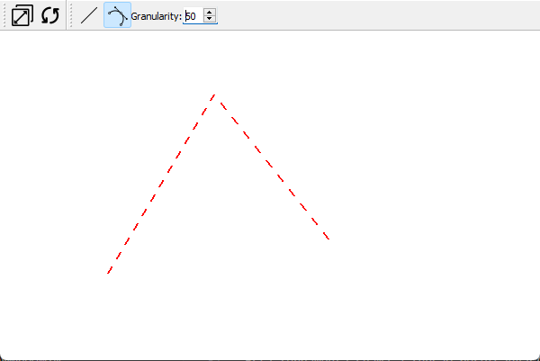

# Modelador Gráfico
Este modelador grafico simples foi construído para propósitos acadêmicos, sendo parte de uma tarefa atribuída por uma das disciplinas do curso de Ciência da Computação.

## Preparação e Execução

Para executar o projeto, certifique-se de ter python3 instalado, instale também as seguintes bibliotecas:

- pyqt5
- numpy
- pyopengl
- matplotlib

Realize a instalação das dependências:

```bash
pip install -U pip setuptools
python3 -m pip install PyQt5
pip install numpy
pip install pyopengl
pip install matplotlib
```

Além das bibliotecas acima, também foi utilizada a biblioteca hetool: https://gitlab.com/danilosb/hetoollibrary (os arquivos da biblioteca hetool já estarão disponíveis ao baixar o projeto)

Baixe os arquivos do repositório e acesse a pasta src, execute o arquivo main:

```bash
python3 main.py
```

## Janela Principal

A janela principal do programa deve ser carregada e parecer como a seguir:


## Ferramentas disponíveis

Estão disponíveis as seguintes ferramentas para serem usadas:


## Ferramentas Gerais:

**Ferramenta Fit**


Esta ferramenta chama a função fitWorldToViewport() implementada no arquivo mycanvas.py
Essa função determinará os pontos máximos na dimensão de elementos desenhados e reajustará para que o desenho se ajuste ao canvas disponível.

**Ferramenta Clean**


Esta ferramenta chama a função resetCanvas() implementada em mycanvas.py
Ao clicar limpará todos os elementos da tela.

## Ferramentas de Desenho

Essas ferramentas interativas permitirão a coleta de elementos para desenho na tela. 2 ferramentas estão disponíveis: Line e Bézier, sendo a primeira para coleta de segmentos de retas e a segunda para segmentos de curvas do tipo bézier quadrática.

**Decisões de projeto:**

Para permitir uma melhor previsualização da coleta, principalmente no caso da bézier, o comportamento da coleta de dados do mouse foi modificado. passando a rastrear o mouse sempre (sem necessidade de haver um evento press), assim, as coletas das curvas são feitas a partir de cliques para coleta de cada ponto, para desenhar uma linha serão usados 2 cliques (uma vez que tem 2 pontos), para desenhar uma curva beziér quadrática são necessários 3 pontos, portanto, 3 cliques.

**Coleta**

- Para geração da prévia, a implementação da coleta pode ser visto no método mouseMoveEvent(), disponível em mycanvas.py
- Na prévia nenhuma curva será desenhada, assim, a prévia de bézier será uma polyline de 3 pontos, os 3 pontos serão usados para coleta da curva final
- A implementação da coleta final dos segmentos pode ser encontrada no método mouseReleaseEvent(), disponível em mycanvas.py
- Condicionais e variáveis de controle ajudam a identificar que tipo de segmento está sendo coletado e quantos pontos
- A realização do desenho das previas e segmentos finais está definida no método paintGL() no arquivo mycanvas.py
- O loop que coleta os pontos da bézier pode ser visto no método mouseReleaseEvent(), usando a equação paramétrica:

<p align=center>B(t) = (1-t)²P0 + 2t(1-t)P1 + t²P2</p>

### **Ferramenta Line**


Desenha uma linha na tela

**uso:**

Acione a ferramenta linha (line) na barra de ferramentas
Clique para coletar o primeiro ponto da linha, uma linha pontilhada na cor vermelha guiará a coleta do próximo ponto:


Clique novamente para coletar o segundo ponto da linha, a linha final será desenhada:


### **Ferramenta Bézier**


Desenha uma linha curva do tipo Bézier Quadrática (3 pontos) na tela

**uso:**

Acione a ferramenta Bézier na barra de ferramentas
Clique para coletar o primeiro ponto da linha, uma linha pontilhada na cor vermelha guiará a coleta do próximo ponto:



Ao coletar o primeiro ponto da linha, uma linha pontilhada na cor vermelha guiará a coleta do próximo ponto:



Clique novamente para coletar o terceiro ponto da linha, a linha final será desenhada a partir dos 3 vertices presentes na linha de prévia:


### Ajustando a granularidade da curva coletada

Para ajustar a quantidade de pontos coletados, um recurso foi adicionado a interface:


Ao ajustar o valor neste input, a variável de granularidade será atualizada, esta variável determina a qualidade das curvas coletadas:

Exemplo de coleta com granularidade 3:


Exemplo de coleta com granularidade 50:


O valor padrão é **50**, o valor máximo permitido é **100**, esse valor máximo foi setado para evitar que o programa consuma muitos recursos e a execução se torne inviável, pode ser ajustado no comando self.granularitySpinBox.setMaximum,() presente no arquivo mywindows.py

## Resize - Redimensionando a janela

A janela pode ser redimensionada pelas extremidades, quando feito, o desenho será ajustado ao tamanho de janela disponível, a proporção é garantida:

Exemplo de janela no tamanho padrão:


Janela redimensionada:


